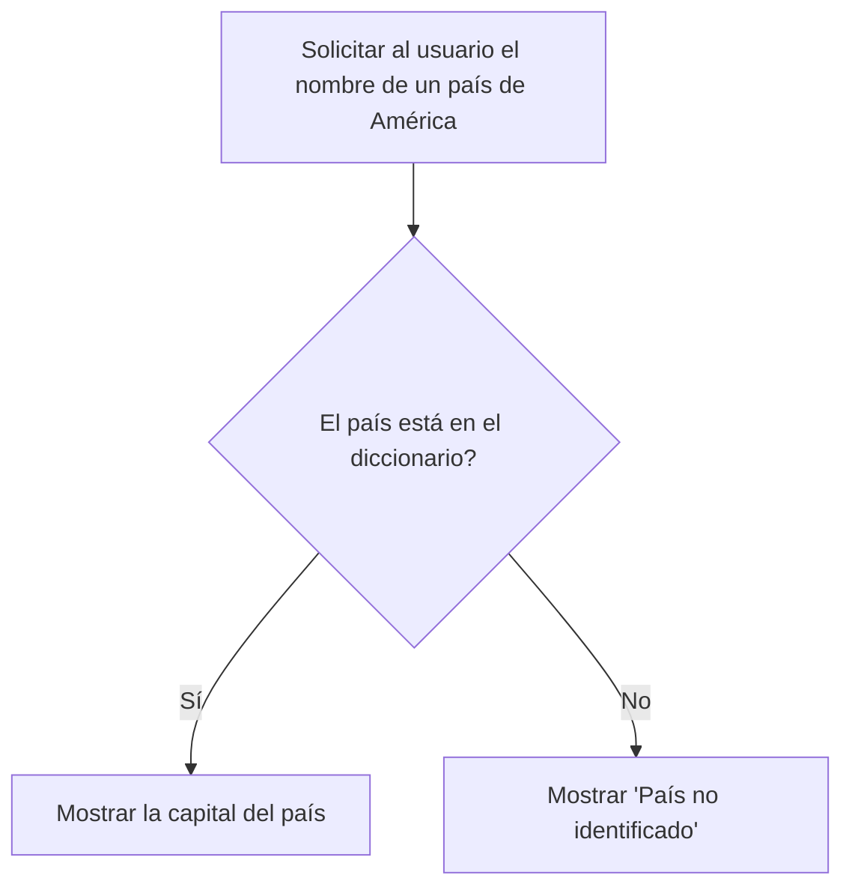

# Taller_1_API-lados
-------------

### Desarrollo del Taller 1 en la asignatura de Programación de Computadores - UNAL
Coordial saludo, nuestro grupo de Programacion se llama API-lados, a continuacion presentamos nuestro logo hecho con IA.

[](https://postimg.cc/rdT79scf)

### Integrantes:
+ Michael Kaleth Mora Mejia (1086774311)
+ Angie Carolina Salazar Lara (1052837889)
+ Alejandro	Urrego Valencia (1000364014)

-------------

1. Como primer punto del taller se encomendo realizar un [Quiz](http://https://pythonspot.com/python-tests-quizes/ "Quiz")
 Python Beginner Quiz (20 preguntas) y adjuntar una imagen con mas del 90% de acierto. En nuestro caso logramos obtener un

-------------
2. Como segundo punto se nos asigno realizar un programa que lea tres números reales y determine cuál es el mayor.

Este código utiliza la función input() para leer los números desde la entrada estándar, luego los convierte a tipo float para permitir números reales. Después, mediante una serie de declaraciones if, elif y else, compara los números entre sí para determinar cuál es el mayor y finalmente lo imprime usando print().
```python
    # Leer tres números reales
    num1 = float(input("Introduce el primer número: "))
    num2 = float(input("Introduce el segundo número: "))
    num3 = float(input("Introduce el tercer número: "))
    
    # Determinar y mostrar el mayor de los tres números
    if num1 >= num2 and num1 >= num3:
        print("El mayor número es:", num1)
    elif num2 >= num1 and num2 >= num3:
        print("El mayor número es:", num2)
    else:
        print("El mayor número es:", num3)
    
    # Código finalizado
```
Aqui esta el diagrama de flujo.

[](https://postimg.cc/G4ZPShMy)

El programa, al ser par, se encuentra en el repositorio con terminacion .py

-------------
3. Para el tercer punto se encomendo realizar un programa que lea un número enteros y determine si es par o impar.

Este código comienza con la lectura de un número entero utilizando input(), convirtiéndolo a entero con int() debido a que input() lee los datos como cadena de texto. Luego, utiliza una declaración if para evaluar si el residuo de dividir el número entre 2 es igual a 0. Si es así, imprime que el número es par; de lo contrario, imprime que es impar.
```python
# Leer un número entero
numero = int(input("Introduce un número entero: "))

# Determinar si el número es par o impar
if numero % 2 == 0:
    print("El número es par.")
else:
    print("El número es impar.")

# Código finalizado

```
Su diagrama de flujo.

[](https://postimg.cc/9rHhVGr8)

El programa se encuentra en el repositorio y al ser impar esta en un mismo archivo con terminacion .ipynb

-------------
4. En este punto se solicita realizar un programa que lea dos números reales y determine si el primero es múltiplo del segundo.

Este código inicia solicitando al usuario que ingrese dos números, que son almacenados en las variables num1 y num2 después de convertirlos a tipo float para permitir números reales. Luego, antes de realizar la operación de módulo, se verifica que el segundo número no sea cero para evitar un error de división por cero. Si num2 no es cero, se procede a calcular el módulo de num1 entre num2. Si el resultado es cero, se imprime que num1 es múltiplo de num2; de lo contrario, se indica que no lo es.

```python
# Leer dos números reales
num1 = float(input("Introduce el primer número real: "))
num2 = float(input("Introduce el segundo número real: "))

# Verificar si num1 es múltiplo de num2
if num2 == 0:
    print("No se puede dividir por cero.")
elif num1 % num2 == 0:
    print(f"El número {num1} es múltiplo de {num2}.")
else:
    print(f"El número {num1} no es múltiplo de {num2}.")

# Código finalizado

```
Su diagrama de flujo.

[](https://postimg.cc/sQ1hVk0r)

El programa, al ser par, se encuentra en el repositorio con terminacion .py

-------------
5. Para este punto se debe realizar un programa que lea tres números reales y determine si la suma de los dos primeros es mayor, menor o igual que el tercer número.

Este programa solicita al usuario que ingrese tres números reales. Los números se leen desde la entrada estándar y se almacenan en variables después de convertirlos a tipo float. Luego, se calcula la suma de los dos primeros números y se compara esta suma con el tercer número. Dependiendo de esta comparación, se imprime si la suma es mayor, menor o igual al tercer número.

```python
# Leer tres números reales
num1 = float(input("Introduce el primer número real: "))
num2 = float(input("Introduce el segundo número real: "))
num3 = float(input("Introduce el tercer número real: "))

# Sumar los dos primeros números
suma = num1 + num2

# Comparar la suma con el tercer número y mostrar el resultado
if suma > num3:
    print("La suma de los dos primeros números es mayor que el tercer número.")
elif suma < num3:
    print("La suma de los dos primeros números es menor que el tercer número.")
else:
    print("La suma de los dos primeros números es igual al tercer número.")

# Código finalizado

```

El programa se encuentra en el repositorio y al ser impar esta en un mismo archivo con terminacion .ipynb

-------------

6. Las instrucciones fueron Escribir un programa que solicite al usuario una letra y determine si es una vocal o una consonante.

El código primero solicita al usuario que ingrese un caracter y lo convierte a minúscula para hacer la comparación de manera case-insensitive. Luego verifica si el caracter ingresado está en la cadena de vocales. Si es así, imprime que es una vocal. Si no está y es una letra del alfabeto (chequeado con isalpha()), imprime que es una consonante. Si no es una letra, informa al usuario que el caracter ingresado no es una letra.

```python
# Solicitar al usuario que ingrese una letra
letra = input("Introduce una letra: ").lower()  # Convertir a minúscula para simplificar la comparación

# Lista de vocales
vocales = 'aeiou'

# Determinar si es una vocal o una consonante y mostrar el resultado
if letra in vocales:
    print(f"La letra '{letra}' es una vocal.")
elif letra.isalpha():
    print(f"La letra '{letra}' es una consonante.")
else:
    print("El caracter ingresado no es una letra.")

# Código finalizado

```

El programa, al ser par, se encuentra en el repositorio con terminacion .py

-------------

8. En este punto se solicitó escribir un programa al que se le ingrese la frecuencia de una onda en hz y como salida arroje en que parte del espectro electromagnético se encuentra.

Para este programa se realizan una serie de pasos que se basan inicialmente en pedir al usuario la frecuencia de la onda en hertzios (Hz) se descomenta la línea que usa input() para permitir al usuario ingresar el valor. Seguido de esto, se define una función determinar_espectro() que utiliza estructuras condicionales (if/elif/else) para determinar en qué parte del espectro electromagnético se encuentra la frecuencia dada, basándose en los rangos definidos para cada tipo de onda.
Usa esta función para obtener la parte del espectro correspondiente a la frecuencia ingresada. Finalmente da el resultado, indicando en qué parte del espectro se encuentra la frecuencia proporcionada.
```python
# Paso 1: Definir los límites de frecuencia para cada categoría del espectro electromagnético
espectro = {
    "Ondas de Radio": (0, 3e9), # hasta 3 GHz
    "Microondas": (3e9, 3e11), # 3 GHz a 300 GHz
    "Infrarrojo": (3e11, 4e14), # 300 GHz a 400 THz
    "Luz Visible": (4e14, 7.5e14), # 400 THz a 750 THz
    "Ultravioleta": (7.5e14, 3e16), # 750 THz a 30 PHz
    "Rayos X": (3e16, 3e19), # 30 PHz a 30 EHz
    "Rayos Gamma": (3e19, 2.9e27) # mayor a 30 EHz
}

# Paso 2: Solicitar al usuario que ingrese la frecuencia de la onda en Hz
frecuencia = 5e14 # Ejemplo de frecuencia

# Paso 3: Determinar en qué parte del espectro electromagnético se encuentra la frecuencia
def encontrar_categoria(frecuencia):
    for categoria, (min_freq, max_freq) in espectro.items():
        if min_freq <= frecuencia < max_freq:
            return categoria
    return "Frecuencia fuera del rango conocido"

# Paso 4: Mostrar la categoría del espectro donde se encuentra la frecuencia ingresada
categoria = encontrar_categoria(frecuencia)
print(f"La frecuencia {frecuencia} Hz se encuentra en la categoría: {categoria}")
```
Se requiere realizar un diagrama de flujo según la terminación de la cédula de los integrantes, en este caso el 9 es uno de los números que nos corresponde. El cual hace referencia al ejercicio en el cual el programa recibe el nombre en minúsculas de un país de America y retorna la ciudad capital y si el país no pertenece al continente debe arrojar país no identificado.


