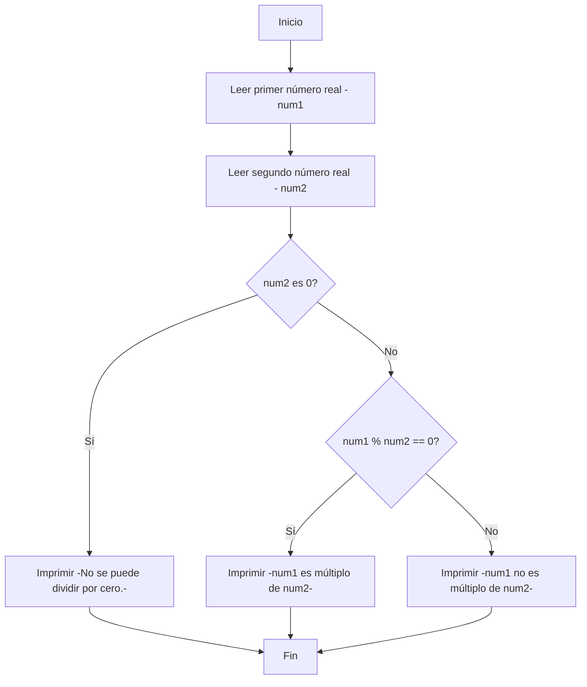
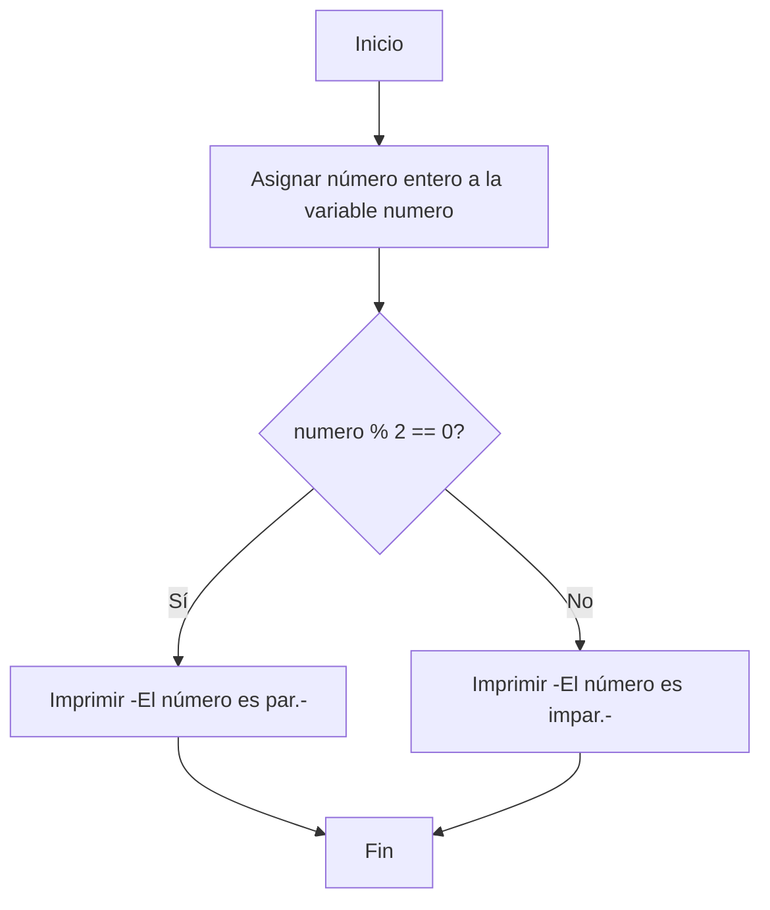
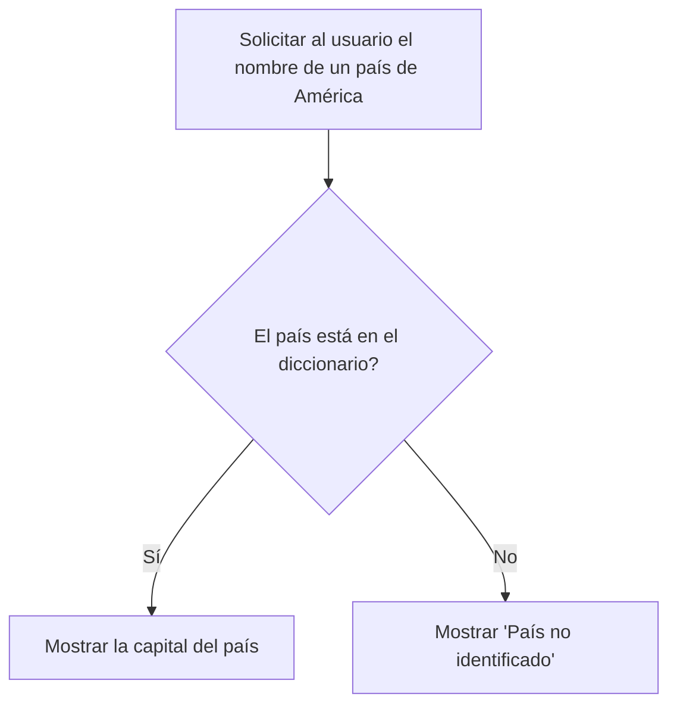

# Taller_1_API-lados
-------------

## Desarrollo del Taller 1 en la asignatura de Programación de Computadores - UNAL
Coordial saludo, nuestro grupo de Programacion se llama API-lados, a continuacion presentamos nuestro logo hecho con IA.

[](https://postimg.cc/rdT79scf)

## Integrantes:
+ Michael Kaleth Mora Mejia (1086774311)
+ Angie Carolina Salazar Lara (1052837889)
+ Alejandro	Urrego Valencia (1000364014)

## Extra

Realizamos la explicacion del Punto 3 del taller, a traves de un [video](http://https://youtu.be/7iY025Nden4?si=0c9ZjtwzETxhgRjx "video") en Youtube

------------

### 1. Como primer punto del taller se encomendo realizar un [Quiz](http://https://pythonspot.com/python-tests-quizes/ "Quiz")
 Python Beginner Quiz (20 preguntas) y adjuntar una imagen con mas del 90% de acierto. En nuestro caso logramos obtener:

-  **Michael Kaleth Mora Mejia**
[](https://postimg.cc/hz5yGyZX)

- **Angie Carolina Salazar Lara**


- **Alejandro	Urrego Valencia**


-------------
### 2. Como segundo punto se nos asigno realizar un programa que lea tres números reales y determine cuál es el mayor.

Este código utiliza la función input() para leer los números desde la entrada estándar, luego los convierte a tipo float para permitir números reales. Después, mediante una serie de declaraciones if, elif y else, compara los números entre sí para determinar cuál es el mayor y finalmente lo imprime usando print().
```python
    # Leer tres números reales
    num1 = float(input("Introduce el primer número: "))
    num2 = float(input("Introduce el segundo número: "))
    num3 = float(input("Introduce el tercer número: "))
    
    # Determinar y mostrar el mayor de los tres números
    if num1 >= num2 and num1 >= num3:
        print("El mayor número es:", num1)
    elif num2 >= num1 and num2 >= num3:
        print("El mayor número es:", num2)
    else:
        print("El mayor número es:", num3)
    
    # Código finalizado
```
Aqui esta el diagrama de flujo.


  
El programa, al ser par, se encuentra en el repositorio con terminacion .py

-------------
### 3. Para el tercer punto se encomendo realizar un programa que lea un número enteros y determine si es par o impar.

Este código comienza con la lectura de un número entero utilizando input(), convirtiéndolo a entero con int() debido a que input() lee los datos como cadena de texto. Luego, utiliza una declaración if para evaluar si el residuo de dividir el número entre 2 es igual a 0. Si es así, imprime que el número es par; de lo contrario, imprime que es impar.
```python
# Asignar un número entero directamente en el código
numero = 10  # Cambiar este valor para probar con diferentes números

# Determinar si el número es par o impar
if numero % 2 == 0:
    print(f"El número {numero} es par.")
else:
    print(f"El número {numero} es impar.")

# Fin codigo

```
Su diagrama de flujo.


El programa se encuentra en el repositorio y al ser impar esta en un mismo archivo con terminacion .ipynb

-------------
### 4. En este punto se solicita realizar un programa que lea dos números reales y determine si el primero es múltiplo del segundo.

Este código inicia solicitando al usuario que ingrese dos números, que son almacenados en las variables num1 y num2 después de convertirlos a tipo float para permitir números reales. Luego, antes de realizar la operación de módulo, se verifica que el segundo número no sea cero para evitar un error de división por cero. Si num2 no es cero, se procede a calcular el módulo de num1 entre num2. Si el resultado es cero, se imprime que num1 es múltiplo de num2; de lo contrario, se indica que no lo es.

```python
# Leer dos números reales
num1 = float(input("Introduce el primer número real: "))
num2 = float(input("Introduce el segundo número real: "))

# Verificar si num1 es múltiplo de num2
if num2 == 0:
    print("No se puede dividir por cero.")
elif num1 % num2 == 0:
    print(f"El número {num1} es múltiplo de {num2}.")
else:
    print(f"El número {num1} no es múltiplo de {num2}.")

# Código finalizado

```
Su diagrama de flujo.


El programa, al ser par, se encuentra en el repositorio con terminacion .py

-------------
### 5. Para este punto se debe realizar un programa que lea tres números reales y determine si la suma de los dos primeros es mayor, menor o igual que el tercer número.

Este programa solicita al usuario que ingrese tres números reales. Los números se leen desde la entrada estándar y se almacenan en variables después de convertirlos a tipo float. Luego, se calcula la suma de los dos primeros números y se compara esta suma con el tercer número. Dependiendo de esta comparación, se imprime si la suma es mayor, menor o igual al tercer número.

```python
# Definir los tres números directamente en el código
numero1 = 3.5  # Aquí puedes cambiar el valor para probar con diferentes números
numero2 = 4.5  # Aquí puedes cambiar el valor para probar con diferentes números
numero3 = 4.0  # Aquí puedes cambiar el valor para probar con diferentes números

# Calcula la suma de los dos primeros números
suma = numero1 + numero2

# Compara la suma con el tercer número e imprime el resultado
if suma > numero3:
    print("La suma de los dos primeros números es mayor que el tercer número.")
elif suma < numero3:
    print("La suma de los dos primeros números es menor que el tercer número.")
else:
    print("La suma de los dos primeros números es igual al tercer número.")

# fin del codigo

```

El programa se encuentra en el repositorio y al ser impar esta en un mismo archivo con terminacion .ipynb

-------------

### 6. Las instrucciones fueron Escribir un programa que solicite al usuario una letra y determine si es una vocal o una consonante.

El código primero solicita al usuario que ingrese un caracter y lo convierte a minúscula para hacer la comparación de manera case-insensitive. Luego verifica si el caracter ingresado está en la cadena de vocales. Si es así, imprime que es una vocal. Si no está y es una letra del alfabeto (chequeado con isalpha()), imprime que es una consonante. Si no es una letra, informa al usuario que el caracter ingresado no es una letra.

```python
# Solicitar al usuario que ingrese una letra
letra = input("Introduce una letra: ").lower()  # Convertir a minúscula para simplificar la comparación

# Lista de vocales
vocales = 'aeiou'

# Determinar si es una vocal o una consonante y mostrar el resultado
if letra in vocales:
    print(f"La letra '{letra}' es una vocal.")
elif letra.isalpha():
    print(f"La letra '{letra}' es una consonante.")
else:
    print("El caracter ingresado no es una letra.")

# Código finalizado

```

El programa, al ser par, se encuentra en el repositorio con terminacion .py

-------------
### 7. Este punto pide realizar un programa que pida 5 números reales y calcule las siguientes operaciones:

- El promedio
- La mediana
- El promedio multiplicativo (multilplica todos y luego calcula la raíz de la cantidad de operandos)
- Ordenar los números de forma ascendente
- Ordenar los números de forma descendente
- La potencia del mayor número elevado al menor número
- La raíz cúbica del menor número

En primer lugar se define una lista llamada numeros que contiene cinco números reales. Aunque se asignan directamente valores para brindar un ejemplo, se utiliza input() para capturar números uno por uno. Luego operacionalmente se realiza:
   1. El calculo del promedio de los números en la lista. Primero, se suman todos los números usando un bucle 'for', y luego divide esa suma por la cantidad de números en la 
   lista para obtener el promedio. Este resultado se imprime en pantalla.
   2. La mediana, primero ordena los números en la lista de manera ascendente usando 'sorted()'. Luego, determina si la cantidad de números es par o impar 
   para calcular la mediana correctamente: si es par, promedia los dos números centrales; si es impar, selecciona el número central directamente. La mediana se imprime en 
   pantalla.
   3. El promedio multiplicativo se calcula multiplicando todos los números entre sí y luego tomando la raíz enésima del producto, donde "n" es la cantidad de números. 
   Este cálculo se realiza multiplicando todos los elementos en un bucle for y luego aplicando la operación de raíz utilizando el exponente '(1/len(numeros))'. El 
   resultado se muestra en pantalla.
   4. Se utiliza 'sorted()' para ordenar la lista de números en orden ascendente y luego imprime el resultado.
   5. Se usa el argumento 'reverse=True' en la función 'sorted()' para ordenar los números en orden descendente. El resultado se imprime en pantalla.
   6. Para calcular la potencia del mayor número elevado al menor número, primero se identifica el mayor y el menor número en la lista usando las funciones 'max()' y 
   'min()', respectivamente. Luego, se calcula la potencia del mayor número elevado al menor y muestra el resultado.
   7. Finalmente, para calcular la raíz cúbica del número más pequeño de la lista y teniendo en cuenta que Python no tiene una función integrada específica para calcular 
   raíces cúbicas, se utiliza la operación de potencia con un exponente de '(1/3)' para obtenerla. Este valor se imprime en pantalla.

```python
   # Celda 1: Solicitar al usuario que ingrese 5 números reales
numeros = [2.3, 4.5, 1.2, 3.4, 5.6]  # Ejemplo de lista de números

# Celda 2: Calcular el promedio
suma = 0
for numero in numeros:
    suma += numero
promedio = suma / len(numeros)
print(f"Promedio: {promedio}")

# Celda 3: Calcular la mediana
numeros_ordenados = sorted(numeros)
mitad = len(numeros_ordenados) // 2
if len(numeros_ordenados) % 2 == 0:
    mediana = (numeros_ordenados[mitad - 1] + numeros_ordenados[mitad]) / 2
else:
    mediana = numeros_ordenados[mitad]
print(f"Mediana: {mediana}")

# Celda 4: Calcular el promedio multiplicativo
producto = 1
for numero in numeros:
    producto *= numero
promedio_multiplicativo = producto ** (1/len(numeros))
print(f"Promedio multiplicativo: {promedio_multiplicativo}")

# Celda 5: Ordenar los números de forma ascendente
numeros_ascendente = sorted(numeros)
print(f"Números en orden ascendente: {numeros_ascendente}")

# Celda 6: Ordenar los números de forma descendente
numeros_descendente = sorted(numeros, reverse=True)
print(f"Números en orden descendente: {numeros_descendente}")

# Celda 7: Calcular la potencia del mayor número elevado al menor número
mayor = max(numeros)
menor = min(numeros)
potencia_mayor_menor = mayor ** menor
print(f"Potencia del mayor número elevado al menor: {potencia_mayor_menor}")

# Celda 8: Calcular la raíz cúbica del menor número
# Como Python no tiene una función integrada específica para la raíz cúbica,
# se utiliza la operación de exponente con 1/3 para calcularla.
raiz_cubica_menor = menor ** (1/3)
print(f"Raíz cúbica del menor número: {raiz_cubica_menor}")
```

El programa se encuentra en el repositorio y al ser impar esta en un mismo archivo con terminacion .ipynb

--------------

### 8. En este punto se solicitó escribir un programa al que se le ingrese la frecuencia de una onda en hz y como salida arroje en que parte del espectro electromagnético se encuentra.

Para este programa se realizan una serie de pasos que se basan inicialmente en pedir al usuario la frecuencia de la onda en hertzios (Hz) se descomenta la línea que usa input() para permitir al usuario ingresar el valor. Seguido de esto, se define una función determinar_espectro() que utiliza estructuras condicionales (if/elif/else) para determinar en qué parte del espectro electromagnético se encuentra la frecuencia dada, basándose en los rangos definidos para cada tipo de onda.
Usa esta función para obtener la parte del espectro correspondiente a la frecuencia ingresada. Finalmente da el resultado, indicando en qué parte del espectro se encuentra la frecuencia proporcionada.
```python

# Paso 1: Definir los límites de frecuencia para cada categoría del espectro electromagnético
espectro = {
    "Ondas de Radio": (0, 3e9), # hasta 3 GHz
    "Microondas": (3e9, 3e11), # 3 GHz a 300 GHz
    "Infrarrojo": (3e11, 4e14), # 300 GHz a 400 THz
    "Luz Visible": (4e14, 7.5e14), # 400 THz a 750 THz
    "Ultravioleta": (7.5e14, 3e16), # 750 THz a 30 PHz
    "Rayos X": (3e16, 3e19), # 30 PHz a 30 EHz
    "Rayos Gamma": (3e19, 2.9e27) # mayor a 30 EHz
}

# Paso 2: Solicitar al usuario que ingrese la frecuencia de la onda en Hz
frecuencia = 5e14 # Ejemplo de frecuencia

# Paso 3: Determinar en qué parte del espectro electromagnético se encuentra la frecuencia
def encontrar_categoria(frecuencia):
    for categoria, (min_freq, max_freq) in espectro.items():
        if min_freq <= frecuencia < max_freq:
            return categoria
    return "Frecuencia fuera del rango conocido"

# Paso 4: Mostrar la categoría del espectro donde se encuentra la frecuencia ingresada
categoria = encontrar_categoria(frecuencia)
print(f"La frecuencia {frecuencia} Hz se encuentra en la categoría: {categoria}")
```

El programa, al ser par, se encuentra en el repositorio con terminacion .py

---------------

### 9. En este caso se pretende realizar un programa que reciba el nombre en minúsculas de un país de America y retorna la ciudad capital y si el país no pertenece al continente debe arrojar país no identificado.
    
Se creó un diccionario llamado capitales, el cual actúa como una pequeña base de datos para el programa. Los países actúan como claves (keys) y sus respectivas capitales como valores (values). Este diccionario incluye una variedad de países de América y sus capitales correspondientes. Seguido a esto, a pesar de que se utiliza un ejemplo, lo ideal es utilizar input() para permitir al usuario ingresar el nombre del país, algo así como pais = input("Ingrese el nombre de un país de América: ").lower(), asegurando que la entrada se convierta a minúsculas para que coincida con las claves del diccionario. Para finalizar el programa utiliza una estructura condicional if para verificar si el país ingresado se encuentra dentro del diccionario capitales. Si el país está en el diccionario (if pais in capitales:), el programa imprime el nombre del país y su capital correspondiente utilizando la sintaxis de formateo de cadenas. Esto se logra mediante el acceso al valor asociado con la clave que coincide con el nombre del país ingresado. Si el país no se encuentra en el diccionario (else:), se imprime un mensaje diciendo "País no identificado" para indicar que el nombre ingresado no coincide con ninguna de las claves del diccionario de capitales.

    
```python
# Paso 1: Definir un diccionario con los países de América y sus capitales
capitales = {
    "argentina": "Buenos Aires",
    "bolivia": "Sucre",
    "brasil": "Brasília",
    "canada": "Ottawa",
    "chile": "Santiago",
    "colombia": "Bogotá",
    "costa rica": "San José",
    "cuba": "La Habana",
    "ecuador": "Quito",
    "el salvador": "San Salvador",
    "estados unidos": "Washington D.C.",
    "guatemala": "Ciudad de Guatemala",
    "haiti": "Puerto Príncipe",
    "honduras": "Tegucigalpa",
    "mexico": "Ciudad de México",
    "nicaragua": "Managua",
    "panama": "Ciudad de Panamá",
    "paraguay": "Asunción",
    "peru": "Lima",
    "republica dominicana": "Santo Domingo",
    "uruguay": "Montevideo",
    "venezuela": "Caracas"
}

# Paso 2: Solicitar al usuario que ingrese el nombre de un país de América
# Para este ejemplo, asignaremos el nombre del país directamente.
pais = "colombia"  # Simula la entrada del usuario

# Paso 3: Verificar si el país está en el diccionario y mostrar la capital
if pais in capitales:
    print(f"La capital de {pais} es: {capitales[pais]}")
else:
    print("País no identificado")

# fin codigo
```

Nos corresponde la realización de un diagrama de flujo para este numeral, el cual está a continuación:



El programa se encuentra en el repositorio y al ser impar esta en un mismo archivo con terminacion .ipynb

---------------
   
### 10. En este caso se pretende crear un programa el cual con una distancia, nos determine el tiempo que tardan distintos casos en recorrer dicha distancia.

Se creó un programa el cual tiene como nombre "	Calcula-tiempos", este programa inicia con un input() de la distancia en metros la cual el usuario desea calcular. a continuación,se tienen diferentes variables según el tiempo de cada caso, es decir, todos los casos utilizan la misma distancia pero cada uno tiene una velocidad diferente. Por lo que al despejar la variable del tiempo, es necesario tener variables diferentes en cada caso. Después de ingresar el calculo de "tiempo=distancia/velocidad". Se imprime la respuesta acompañada con el contexto del caso. 

```python
# Paso 1: establecer el input() de la distancia
# Paso 2: ingresar un numero equivalente a una distancia en metros


print("Bienvenidos al programa ´Calcula-tiempos´")
distancia : float = float(input("Ingrese una distancia (metros): "))

tiempoLuz : float = distancia/3.0e+8
print(f"El tiempo que tarda la luz en recorrer {distancia} metros es de: {tiempoLuz} segundos.")

tiempoAire : float = distancia/349
print(f"El tiempo que tarda el sonido en recorrer {distancia} metros con una temperatura en el aire de 30°C es de: {tiempoAire} segundos.")

tiempoCarro : float = distancia/136.25
print(f"El tiempo que tarda el Bugatti Chiron en recorrer {distancia} metros es de: {tiempoCarro} segundos.")

tiempoBolt : float = distancia/11.66
print(f"El tiempo que tarda Usain Bolt en recorrer {distancia} metros es de: {tiempoBolt} segundos.")

# Paso 3: Verificar la veracidad de la respuesta

# fin codigo
```


